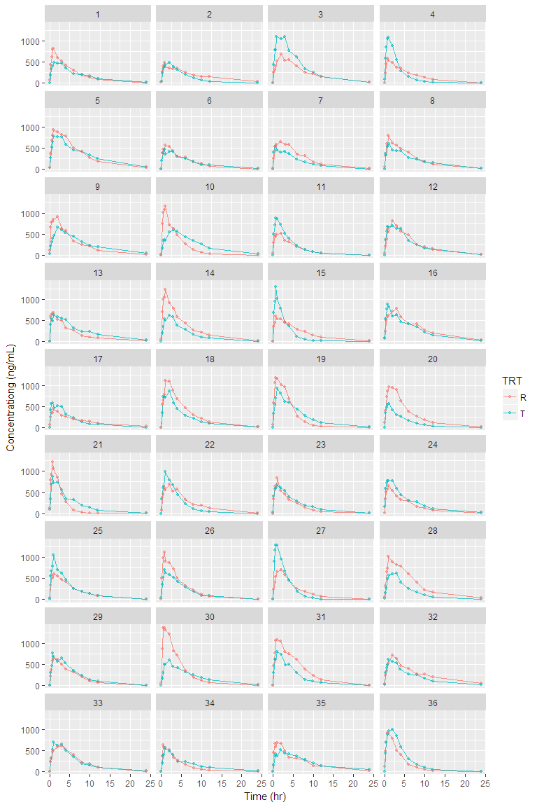

R pacakge: ncarbe
================
Sungpil Han
2017-09-22

개요
====

`NonCompart` 패키지를 사용해서 2x2 생동성시험의 분산분석 등을 손쉽게 해주는 패키지입니다. 지원하는 계산은 다음과 같습니다.

<table style="width:100%;">
<colgroup>
<col width="4%" />
<col width="95%" />
</colgroup>
<thead>
<tr class="header">
<th>parameters</th>
<th>statistics</th>
</tr>
</thead>
<tbody>
<tr class="odd">
<td><code>AUClast</code></td>
<td>Analysis of variance, between and within subject variability, least square means, confidence interval, and sample size</td>
</tr>
<tr class="even">
<td><code>Cmax</code></td>
<td>Analysis of variance, between and within subject variability, least square means, confidence interval, and sample size</td>
</tr>
<tr class="odd">
<td><code>Tmax</code></td>
<td>Wilcoxon Signed-Rank Test and Hodges-Lehmann Estimate</td>
</tr>
</tbody>
</table>

설치
====

``` r
install.packages('devtools')
devtools::install_github('asancpt/ncarbe')
```

실행
====

예제 데이타 (시뮬레이션 데이타)
-------------------------------

2x2 생동성시험 디자인으로 36명의 데이타를 생성하여 시뮬레이션 한 것입니다. (배균섭 교수님 `pk1coma.R` 사용)

``` r
file <- system.file('example', 'beConc.csv', package = 'ncarbe')
concData <- read.csv(file, as.is = TRUE)
head(concData)
```

    ##   SUBJ GRP PRD TRT nTIME TIME   CONC
    ## 1    1  RT   1   R  0.00 0.02  63.42
    ## 2    1  RT   1   R  0.25 0.24 432.76
    ## 3    1  RT   1   R  0.50 0.51 622.88
    ## 4    1  RT   1   R  0.75 0.80 809.93
    ## 5    1  RT   1   R  1.00 1.02 824.34
    ## 6    1  RT   1   R  2.00 2.04 602.22

자료 탐색
---------

그림을 그려보면 다음과 같습니다.

``` r
library(ggplot2)
library(dplyr)

concData %>% 
  ggplot(aes(x = TIME, y = CONC, group = TRT, color = TRT)) +
  geom_line(size = 0.5, alpha = 0.8) +
  geom_point(size = 1, alpha = 0.5) +
  xlab('Time (hr)') +
  ylab('Concentrationg (ng/mL)') +
  facet_wrap( ~ SUBJ, ncol = 4)
```



생동성 분석
-----------

`beNCA()` 함수를 사용하여 분석한 결과입니다.

### method = 'kbe'

``` r
library(ncarbe)
```

    ## Warning: replacing previous import 'dplyr::collapse' by 'nlme::collapse'
    ## when loading 'ncarbe'

``` r
beNCA(concData)     # method = 'kbe'
```

    ## 
    ## 
    ## [AUClast]
    ## 
    ## $`Analysis of Variance`
    ##                       SS DF         MS        F          p
    ## SUBJECT        2.8102897 35 0.08029399 2.049048 0.01947896
    ## GROUP          0.2811516  1 0.28115157 3.779609 0.06019307
    ## SUBJECT(GROUP) 2.5291381 34 0.07438642 1.898290 0.03291404
    ## PERIOD         0.2887407  1 0.28874073 7.368465 0.01035002
    ## DRUG           0.1186721  1 0.11867210 3.028430 0.09086256
    ## ERROR          1.3323243 34 0.03918601       NA         NA
    ## TOTAL          4.5500268 71         NA       NA         NA
    ## 
    ## $`Between and Within Subject Variability`
    ##                                 Between Subject Within Subject
    ## Variance Estimate                     0.0176002     0.03918601
    ## Coefficient of Variation, CV(%)      13.3251642    19.99097469
    ## 
    ## $`Least Square Means`
    ##                 Reference Drug Test Drug
    ## Geometric Means       5047.026  4648.063
    ## 
    ## $`90% Confidence Interval`
    ##                  Lower Limit Point Estimate Upper Limit
    ## 90% CI for Ratio   0.8501323       0.920951   0.9976692
    ## 
    ## $`Sample Size`
    ##                       True Ratio=1 True Ratio=Point Estimate
    ## 80% Power Sample Size            8                        13
    ## 
    ## 
    ## 
    ## [Cmax]

    ## Warning in sqrt(exp(sig2b) - 1): NaN이 생성되었습니다

    ## $`Analysis of Variance`
    ##                        SS DF         MS         F         p
    ## SUBJECT        2.85581816 35 0.08159480 0.9764709 0.5283290
    ## GROUP          0.08840271  1 0.08840271 1.0861008 0.3046908
    ## SUBJECT(GROUP) 2.76741545 34 0.08139457 0.9740747 0.5302983
    ## PERIOD         0.04931289  1 0.04931289 0.5901430 0.4476669
    ## DRUG           0.10908566  1 0.10908566 1.3054627 0.2612001
    ## ERROR          2.84107119 34 0.08356092        NA        NA
    ## TOTAL          5.85528790 71         NA        NA        NA
    ## 
    ## $`Between and Within Subject Variability`
    ##                                 Between Subject Within Subject
    ## Variance Estimate                  -0.001083173     0.08356092
    ## Coefficient of Variation, CV(%)             NaN    29.52142270
    ## 
    ## $`Least Square Means`
    ##                 Reference Drug Test Drug
    ## Geometric Means       791.1619     731.1
    ## 
    ## $`90% Confidence Interval`
    ##                  Lower Limit Point Estimate Upper Limit
    ## 90% CI for Ratio   0.8221796       0.924084    1.038619
    ## 
    ## $`Sample Size`
    ##                       True Ratio=1 True Ratio=Point Estimate
    ## 80% Power Sample Size           16                        26
    ## 
    ## 
    ## 
    ## [Tmax]
    ## 
    ## $`Wilcoxon Signed-Rank Test`
    ##   p-value 
    ## 0.3059991 
    ## 
    ## $`Hodges-Lehmann Estimate`
    ##                            Lower Limit Point Estimate Upper Limit
    ## 90% Confidence Interval       -0.10000         0.0300       0.405
    ## 90% Confidence Interval(%)    92.18517       102.3444     131.650

### method = 'nlme'

``` r
beNCA(concData, method = 'nlme')
```

    ## $Confidence.Interval
    ## # A tibble: 2 x 4
    ##   parameter `Lower limit of 90% CI` `T/R ratio` `Upper limit of 90% CI`
    ##       <chr>                   <dbl>       <dbl>                   <dbl>
    ## 1      Cmax               0.8226291    0.924084               1.0380513
    ## 2   AUClast               0.8488229    0.920951               0.9992081

Reference
=========

-   <p>
    Bae K (2017). <em>NonCompart: Noncompartmental Analysis for Pharmacokinetic Data</em>. R package version 0.3.3, <a href="https://CRAN.R-project.org/package=NonCompart">https://CRAN.R-project.org/package=NonCompart</a>.
    </p>
-   <p>
    Bae K and Han S (2017). <em>ncarbe: Perform BE Test Using NonCompart Package</em>. R package version 0.1.0.
    </p>
-   <p>
    Pinheiro J, Bates D, DebRoy S, Sarkar D and R Core Team (2017). <em>nlme: Linear and Nonlinear Mixed Effects Models</em>. R package version 3.1-131, <a href="https://CRAN.R-project.org/package=nlme">https://CRAN.R-project.org/package=nlme</a>.
    </p>
