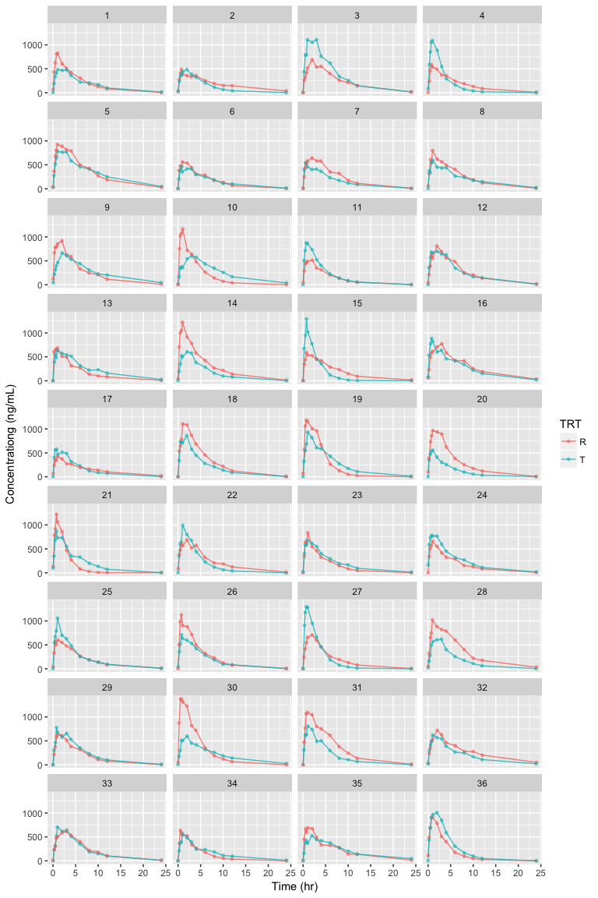

R pacakge: ncarbe
================
Sungpil Han
2018-06-07


`NonCompart` 패키지를 사용해서 2x2 생동성시험의 분산분석 등을 손쉽게 해주는 패키지입니다. 지원하는 계산은 다음과 같습니다.

<table style="width:100%;">
<colgroup>
<col width="4%" />
<col width="95%" />
</colgroup>
<thead>
<tr class="header">
<th>parameters</th>
<th>statistics</th>
</tr>
</thead>
<tbody>
<tr class="odd">
<td><code>AUClast</code></td>
<td>Analysis of variance, between and within subject variability, least square means, confidence interval, and sample size</td>
</tr>
<tr class="even">
<td><code>Cmax</code></td>
<td>Analysis of variance, between and within subject variability, least square means, confidence interval, and sample size</td>
</tr>
<tr class="odd">
<td><code>Tmax</code></td>
<td>Wilcoxon Signed-Rank Test and Hodges-Lehmann Estimate</td>
</tr>
</tbody>
</table>

설치
====

``` r
install.packages('devtools')
devtools::install_github('asancpt/ncarbe')
```

실행
====

예제 데이타 (시뮬레이션 데이타)
-------------------------------

2x2 생동성시험 디자인으로 36명의 데이타를 생성하여 시뮬레이션 한 것입니다. (배균섭 교수님 `pk1coma.R` 사용)

``` r
file <- system.file('example', 'beConc.csv', package = 'ncarbe')
concData <- read.csv(file, as.is = TRUE)
head(concData)
```

    ##   SUBJ GRP PRD TRT nTIME TIME   CONC
    ## 1    1  RT   1   R  0.00 0.02  63.42
    ## 2    1  RT   1   R  0.25 0.24 432.76
    ## 3    1  RT   1   R  0.50 0.51 622.88
    ## 4    1  RT   1   R  0.75 0.80 809.93
    ## 5    1  RT   1   R  1.00 1.02 824.34
    ## 6    1  RT   1   R  2.00 2.04 602.22

자료 탐색
---------

그림을 그려보면 다음과 같습니다.

``` r
library(ggplot2)
library(dplyr)

concData %>% 
  ggplot(aes(x = TIME, y = CONC, group = TRT, color = TRT)) +
  geom_line(size = 0.5, alpha = 0.8) +
  geom_point(size = 1, alpha = 0.5) +
  xlab('Time (hr)') +
  ylab('Concentrationg (ng/mL)') +
  facet_wrap( ~ SUBJ, ncol = 4)
```



생동성 분석
-----------

`beNCA()` 함수를 사용하여 분석한 결과입니다.

### method = 'kbe'

``` r
library(ncarbe)
beNCA(concData)     # method = 'kbe'
```

    ## 
    ## 
    ## [AUClast]
    ## 
    ## $`Analysis of Variance`
    ##                        SS DF        MS        F           p
    ## SUBJECT        35.7817072 35 1.0223345 1.854676 0.037320327
    ## GROUP           1.1390308  1 1.1390308 1.117900 0.297825788
    ## SUBJECT(GROUP) 34.6426764 34 1.0189022 1.848449 0.038831903
    ## PERIOD          4.1989873  1 4.1989873 7.617625 0.009244748
    ## DRUG            0.7021705  1 0.7021705 1.273848 0.266947114
    ## ERROR          18.7414811 34 0.5512200       NA          NA
    ## TOTAL          58.9756619 71        NA       NA          NA
    ## 
    ## $`Between and Within Subject Variability`
    ##                                 Between Subject Within Subject
    ## Variance Estimate                     0.2338411        0.55122
    ## Coefficient of Variation, CV(%)      51.3267693       85.75365
    ## 
    ## $`Least Square Means`
    ##                 Reference Drug Test Drug
    ## Geometric Means       31.20441   25.5401
    ## 
    ## $`90% Confidence Interval`
    ##                  Lower Limit Point Estimate Upper Limit
    ## 90% CI for Ratio   0.6062815      0.8184771     1.10494
    ## 
    ## $`Sample Size`
    ##                       True Ratio=1 True Ratio=Point Estimate
    ## 80% Power Sample Size           96                      6538
    ## 
    ## 
    ## 
    ## [Cmax]

    ## Warning in sqrt(exp(sig2b) - 1): NaN이 생성되었습니다

    ## $`Analysis of Variance`
    ##                        SS DF        MS         F          p
    ## SUBJECT        22.1199814 35 0.6319995 0.6475704 0.89703843
    ## GROUP           0.2047080  1 0.2047080 0.3175901 0.57675784
    ## SUBJECT(GROUP) 21.9152734 34 0.6445669 0.6604475 0.88422171
    ## PERIOD          3.6728929  1 3.6728929 3.7633843 0.06071806
    ## DRUG            0.1136911  1 0.1136911 0.1164922 0.73497096
    ## ERROR          33.1824629 34 0.9759548        NA         NA
    ## TOTAL          58.9756619 71        NA        NA         NA
    ## 
    ## $`Between and Within Subject Variability`
    ##                                 Between Subject Within Subject
    ## Variance Estimate                     -0.165694      0.9759548
    ## Coefficient of Variation, CV(%)             NaN    128.5962569
    ## 
    ## $`Least Square Means`
    ##                 Reference Drug Test Drug
    ## Geometric Means       26.30688  28.51506
    ## 
    ## $`90% Confidence Interval`
    ##                  Lower Limit Point Estimate Upper Limit
    ## 90% CI for Ratio   0.7270811       1.083939    1.615946
    ## 
    ## $`Sample Size`
    ##                       True Ratio=1 True Ratio=Point Estimate
    ## 80% Power Sample Size          169                       298
    ## 
    ## 
    ## 
    ## [Tmax]
    ## 
    ## $`Wilcoxon Signed-Rank Test`
    ##   p-value 
    ## 0.3286283 
    ## 
    ## $`Hodges-Lehmann Estimate`
    ##                            Lower Limit Point Estimate Upper Limit
    ## 90% Confidence Interval       -2.00000         1.0000      4.0000
    ## 90% Confidence Interval(%)    87.11261       106.4437    125.7748

### method = 'nlme'

``` r
beNCA(concData, method = 'nlme')
```

    ## $Confidence.Interval
    ## # A tibble: 2 x 4
    ##   parameter `Lower limit of 90% CI` `T/R ratio` `Upper limit of 90% CI`
    ##   <chr>                       <dbl>       <dbl>                   <dbl>
    ## 1 Cmax                        0.753       1.08                     1.56
    ## 2 AUClast                     0.606       0.818                    1.10

Reference
=========

-   <p>
    Bae K (2018). <em>NonCompart: Noncompartmental Analysis for Pharmacokinetic Data</em>. R package version 0.4.2, <a href="https://CRAN.R-project.org/package=NonCompart">https://CRAN.R-project.org/package=NonCompart</a>.
    </p>
-   <p>
    Bae K, Han S (2018). <em>ncarbe: Perform BE Test Using NonCompart Package</em>. R package version 0.1.1.
    </p>
-   <p>
    Pinheiro J, Bates D, DebRoy S, Sarkar D, R Core Team (2018). <em>nlme: Linear and Nonlinear Mixed Effects Models</em>. R package version 3.1-137, <a href="https://CRAN.R-project.org/package=nlme">https://CRAN.R-project.org/package=nlme</a>.
    </p>

devtools::session\_info()
=========================

``` r
devtools::session_info()
```

    ## Session info -------------------------------------------------------------

    ##  setting  value                       
    ##  version  R version 3.5.0 (2018-04-23)
    ##  system   x86_64, darwin17.5.0        
    ##  ui       unknown                     
    ##  language (EN)                        
    ##  collate  C                           
    ##  tz       Asia/Seoul                  
    ##  date     2018-06-07

    ## Packages -----------------------------------------------------------------

    ##  package    * version date       source        
    ##  assertthat   0.2.0   2017-04-11 CRAN (R 3.5.0)
    ##  backports    1.1.2   2017-12-13 CRAN (R 3.5.0)
    ##  base       * 3.5.0   2018-05-02 local         
    ##  bindr        0.1.1   2018-03-13 CRAN (R 3.5.0)
    ##  bindrcpp   * 0.2.2   2018-03-29 CRAN (R 3.5.0)
    ##  cli          1.0.0   2017-11-05 CRAN (R 3.5.0)
    ##  colorspace   1.3-2   2016-12-14 CRAN (R 3.5.0)
    ##  compiler     3.5.0   2018-05-02 local         
    ##  crayon       1.3.4   2017-09-16 CRAN (R 3.5.0)
    ##  datasets   * 3.5.0   2018-05-02 local         
    ##  devtools     1.13.5  2018-02-18 CRAN (R 3.5.0)
    ##  digest       0.6.15  2018-01-28 CRAN (R 3.5.0)
    ##  dplyr      * 0.7.5   2018-05-19 CRAN (R 3.5.0)
    ##  evaluate     0.10.1  2017-06-24 CRAN (R 3.5.0)
    ##  ggplot2    * 2.2.1   2016-12-30 CRAN (R 3.5.0)
    ##  glue         1.2.0   2017-10-29 CRAN (R 3.5.0)
    ##  graphics   * 3.5.0   2018-05-02 local         
    ##  grDevices  * 3.5.0   2018-05-02 local         
    ##  grid         3.5.0   2018-05-02 local         
    ##  gtable       0.2.0   2016-02-26 CRAN (R 3.5.0)
    ##  htmltools    0.3.6   2017-04-28 CRAN (R 3.5.0)
    ##  knitr        1.20    2018-02-20 CRAN (R 3.5.0)
    ##  labeling     0.3     2014-08-23 CRAN (R 3.5.0)
    ##  lattice      0.20-35 2017-03-25 CRAN (R 3.5.0)
    ##  lazyeval     0.2.1   2017-10-29 CRAN (R 3.5.0)
    ##  magrittr     1.5     2014-11-22 CRAN (R 3.5.0)
    ##  memoise      1.1.0   2017-04-21 CRAN (R 3.4.2)
    ##  methods    * 3.5.0   2018-05-02 local         
    ##  munsell      0.4.3   2016-02-13 CRAN (R 3.5.0)
    ##  ncarbe     * 0.1.1   2018-06-07 local         
    ##  nlme         3.1-137 2018-04-07 CRAN (R 3.5.0)
    ##  NonCompart   0.4.2   2018-05-17 CRAN (R 3.5.0)
    ##  pillar       1.2.3   2018-05-25 CRAN (R 3.5.0)
    ##  pkgconfig    2.0.1   2017-03-21 CRAN (R 3.5.0)
    ##  plyr         1.8.4   2016-06-08 CRAN (R 3.5.0)
    ##  purrr        0.2.5   2018-05-29 CRAN (R 3.5.0)
    ##  R6           2.2.2   2017-06-17 CRAN (R 3.5.0)
    ##  Rcpp         0.12.17 2018-05-18 CRAN (R 3.5.0)
    ##  rlang        0.2.1   2018-05-30 CRAN (R 3.5.0)
    ##  rmarkdown    1.9     2018-03-01 CRAN (R 3.5.0)
    ##  rprojroot    1.3-2   2018-01-03 CRAN (R 3.5.0)
    ##  scales       0.5.0   2017-08-24 CRAN (R 3.5.0)
    ##  stats      * 3.5.0   2018-05-02 local         
    ##  stringi      1.2.2   2018-05-02 CRAN (R 3.5.0)
    ##  stringr      1.3.1   2018-05-10 CRAN (R 3.5.0)
    ##  tibble       1.4.2   2018-01-22 CRAN (R 3.5.0)
    ##  tidyselect   0.2.4   2018-02-26 CRAN (R 3.5.0)
    ##  tools        3.5.0   2018-05-02 local         
    ##  utf8         1.1.4   2018-05-24 CRAN (R 3.5.0)
    ##  utils      * 3.5.0   2018-05-02 local         
    ##  withr        2.1.2   2018-03-15 CRAN (R 3.5.0)
    ##  yaml         2.1.19  2018-05-01 CRAN (R 3.5.0)
